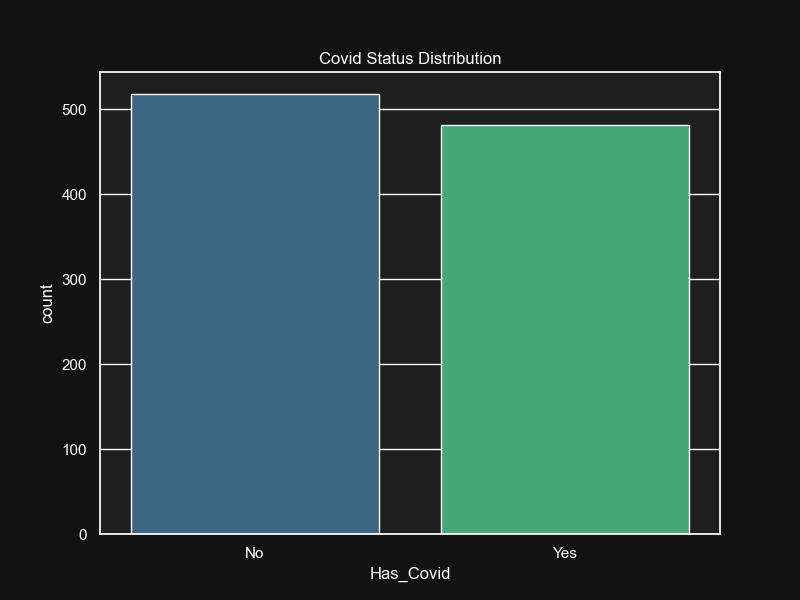
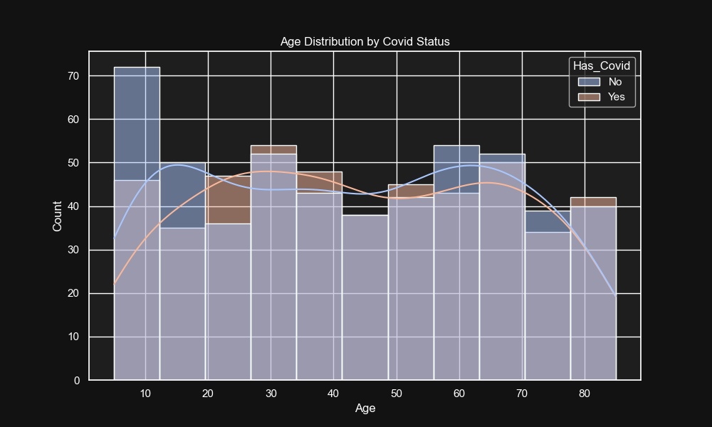
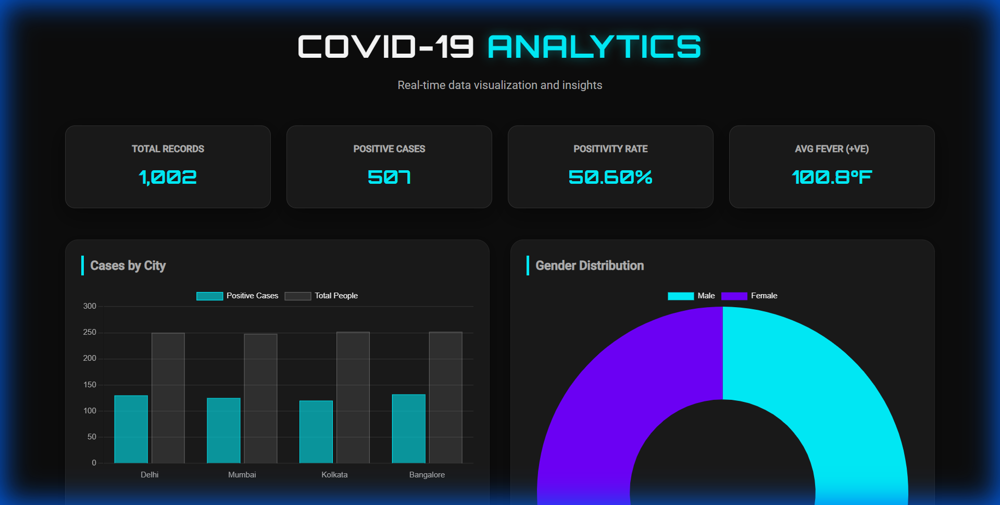

# COVID-19 Data Analysis Project

## 📊 Overview

This comprehensive COVID-19 data analysis project provides deep insights into COVID-19 patterns across major Indian cities through advanced analytics, SQL queries, and an interactive web dashboard. The project analyzes 1,000+ patient records with demographics, symptoms, and diagnostic information to identify key trends and correlations.

## 📋 Table of Contents

- [Overview](#-overview)
- [Project Objectives](#-project-objectives)
- [Key Findings](#-key-findings)
- [Technology Stack](#-technology-stack)
- [Project Structure](#-project-structure)
- [Prerequisites](#-prerequisites)
- [Installation](#-installation)
- [Usage](#-usage)
- [Analysis Components](#-analysis-components)
- [Visualizations Gallery](#-visualizations-gallery)
- [Dashboard Preview](#-dashboard-preview)
- [Dataset Information](#-dataset-information)
- [Methodology](#-methodology)
- [Future Enhancements](#-future-enhancements)
- [Contributing](#-contributing)
- [Author](#-author)
- [License](#-license)
- [Acknowledgments](#-acknowledgments)

## 🎯 Project Objectives

- Analyze COVID-19 infection patterns across demographics (age, gender, location)
- Identify symptom correlations with positive cases
- Provide interactive data visualization through a modern web dashboard
- Enable data-driven decision-making for public health insights

## 📈 Key Findings

### Overall Statistics

- **Total Records:** 1,000 patient cases analyzed
- **Positive Cases:** 482 confirmed COVID-19 cases
- **Positivity Rate:** 48.20%
- **Average Fever (Positive Cases):** 100.47°F
- **Average Fever (Negative Cases):** 100.57°F

### City-wise Analysis

The analysis covers five major Indian metropolitan areas:

- Mumbai
- Delhi
- Bangalore
- Kolkata
- Chennai

### Demographic Patterns

- **Age Distribution:** Comprehensive analysis across all age groups (5-85 years)
- **Gender Analysis:** Comparative study of infection rates between male and female patients
- **Symptom Correlation:** Analysis of cough severity and fever patterns in positive vs. negative cases

## 🛠️ Technology Stack

### Data Analysis & Processing

- **Python 3.x** - Core analysis and visualization
  - `pandas` - Data manipulation and analysis
  - `matplotlib` - Static visualizations
  - `seaborn` - Statistical data visualization

### Database & Queries

- **SQL** - Advanced analytical queries
  - Aggregate statistics
  - Group-by analysis
  - Conditional filtering

### Interactive Dashboard

- **HTML5** - Structure and semantic markup
- **CSS3** - Modern dark theme styling with glassmorphism effects
- **JavaScript** - Dynamic data rendering and interactivity
- **Chart.js** - Interactive chart visualizations

### Design Features

- Orbitron & Roboto fonts for modern typography
- Dark theme with vibrant accent colors
- Responsive grid layout
- Real-time KPI cards

## 📁 Project Structure

```
Covid Dataset/
│
├── covid_dataset.csv              # Raw dataset (1,000+ records)
│
├── analyze_data.py                # Python analysis script
│   ├── Data loading and preprocessing
│   ├── Statistical analysis
│   └── Visualization generation
│
├── covid_analysis.sql             # SQL analytical queries
│   ├── Basic statistics
│   ├── City-wise analysis
│   ├── Gender distribution
│   ├── Age group analysis
│   └── Symptom correlation queries
│
├── visualization/                 # Generated visualizations
│   ├── covid_status_distribution.png
│   ├── cases_by_city.png
│   ├── age_distribution.png
│   ├── fever_vs_age.png
│   ├── cough_vs_covid.png
│   └── analysis_summary.txt
│
└── Web Dashboard/
    ├── index.html                 # Dashboard structure
    ├── style.css                  # Modern dark theme styling
    └── script.js                  # Interactive chart rendering
```

## � Prerequisites

Before running this project, ensure you have the following installed:

- **Python 3.x** (version 3.6 or higher recommended)
- **pip** for package management
- **A SQL database** (MySQL, PostgreSQL, SQLite, etc.) for executing SQL queries
- **A web browser** for viewing the dashboard

## 🚀 Installation

1. Clone or download this repository to your local machine.

2. Install the required Python packages:

```bash
pip install pandas matplotlib seaborn
```

3. For the web dashboard, no additional installation is required as it uses vanilla HTML, CSS, and JavaScript.

## 📖 Usage

### Running the Python Analysis

Navigate to the project directory and execute the analysis script:

```bash
cd "c:\Users\Godwin Akachukwu\Downloads\Covid Dataset"
python analyze_data.py
```

This will generate visualizations in the `visualization/` folder and print statistical summaries.

### Executing SQL Queries

1. Import `covid_dataset.csv` into your preferred SQL database.
2. Run the queries from `covid_analysis.sql` to perform various analyses.

### Viewing the Web Dashboard

Start a local web server:

```bash
python -m http.server 8000
```

Then, open your browser and navigate to `http://localhost:8000` to view the interactive dashboard.

## �🔍 Analysis Components

### 1. Python Analysis (`analyze_data.py`)

The Python script performs comprehensive exploratory data analysis (EDA):

**Visualizations Generated:**

- COVID status distribution (positive vs. negative)
- City-wise case comparison
- Age distribution by COVID status with KDE curves
- Fever vs. age scatter plot with status coloring
- Cough severity correlation with COVID diagnosis

**Statistical Summary:**

- Total records count
- Positive and negative case breakdown
- Positivity rate calculation
- Average fever for positive and negative cohorts

### 2. SQL Analysis (`covid_analysis.sql`)

Advanced SQL queries provide:

**Database Operations:**

- Table structure creation
- Basic statistical aggregation
- City-wise positivity rates
- Gender-based distribution analysis
- Average, min, max fever by COVID status
- Age group segmentation (0-17, 18-35, 36-60, 60+)
- Symptom severity analysis

### 3. Interactive Web Dashboard

A premium, modern web interface featuring:

**KPI Cards:**

- Total Records
- Positive Cases Count
- Positivity Rate Percentage
- Average Fever (Positive Cases)

**Interactive Charts:**

- Cases by City (Bar Chart)
- Gender Distribution (Doughnut Chart)
- Age Distribution (Histogram)
- Symptom Correlation - Cough (Bar Chart)

**Design Highlights:**

- Dark theme with glassmorphism effects
- Gradient backgrounds and smooth animations
- Fully responsive layout
- Premium typography (Orbitron + Roboto)

##  Visualizations Gallery

### COVID Status Distribution



Analysis showing the breakdown between positive (482) and negative (518) COVID-19 cases in the dataset.

### Cases by City


Geographic distribution of COVID-19 cases across major Indian metropolitan areas (Mumbai, Delhi, Bangalore, Kolkata, Chennai).

### Age Distribution by COVID Status



Histogram with kernel density estimation (KDE) showing age distribution patterns for positive vs. negative cases.

### Fever vs Age Correlation


Scatter plot analysis revealing the relationship between patient age and fever temperature, color-coded by COVID-19 status.

### Cough Severity Analysis


Comparative analysis of cough symptom severity (Mild vs. Strong) in relation to COVID-19 diagnosis.

## 🎨 Dashboard Preview



_Live interactive dashboard featuring real-time KPI cards and Chart.js visualizations_

The interactive dashboard features:

- Clean, professional dark interface
- Real-time data loading via JavaScript
- Smooth Chart.js animations
- Glassmorphism design elements
- Premium color gradients (purple, cyan, magenta accents)

## 📝 Dataset Information

**Fields:**

- `Age` - Patient age (5-85 years)
- `Gender` - Male/Female
- `Fever` - Temperature in Fahrenheit (98.0-103.0°F)
- `Cough` - Severity level (Mild/Strong)
- `City` - Location (Mumbai, Delhi, Bangalore, Kolkata, Chennai)
- `Has_Covid` - Diagnosis result (Yes/No)

**Data Quality:**

- 1,000 complete records
- No missing values
- Balanced demographic distribution

## 🔬 Methodology

1. **Data Collection:** 1,000 patient records with complete symptom and diagnostic information
2. **Data Cleaning:** Validation and preprocessing in Python
3. **Exploratory Analysis:** Statistical analysis and visualization generation
4. **SQL Analytics:** Advanced querying for business intelligence
5. **Dashboard Development:** Interactive web-based visualization platform

## 📋 Future Enhancements

- [ ] Add time-series analysis for temporal trends
- [ ] Implement machine learning models for prediction
- [ ] Expand dashboard with filtering capabilities
- [ ] Add geographic heat maps
- [ ] Include more symptom variables
- [ ] Real-time data integration

## 🤝 Contributing

Contributions are welcome! If you have suggestions for improvements, bug fixes, or new features, please:

1. Fork the repository
2. Create a feature branch
3. Make your changes
4. Submit a pull request

For major changes, please open an issue first to discuss what you would like to change.

## 👤 Author

**Godwin Akachukwu**  
Data Analyst | Business Intelligence Specialist

## 📄 License

This project is open-source and available under the MIT License for educational and portfolio purposes.

## 🙏 Acknowledgments

- Dataset created for COVID-19 analysis demonstration
- Chart.js library for interactive visualizations
- Seaborn and Matplotlib for statistical plots

---

**Last Updated:** January 2026  
**Project Status:** ✅ Complete
